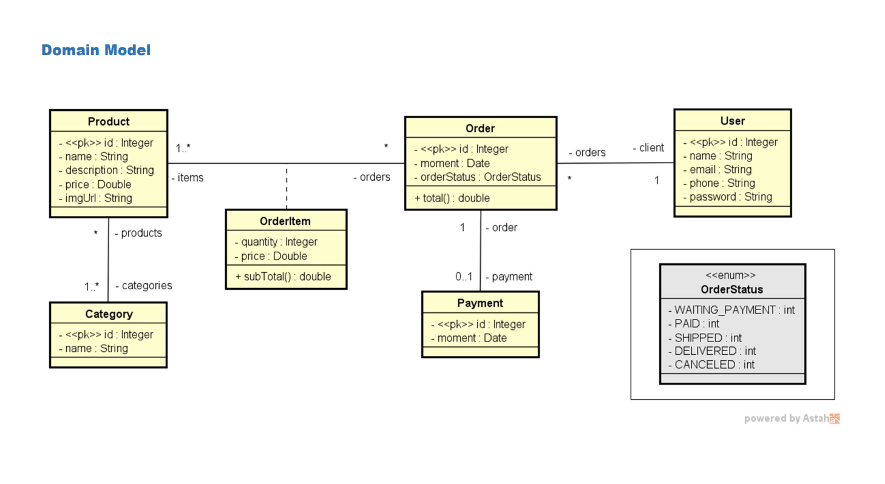

## Spring Boot 3 and JPA Web Service

This project provides a hands-on learning experience for building a RESTful web service using Spring Boot 3 and JPA. It focuses on implementing CRUD operations for users with an in-memory H2 database while demonstrating best practices such as:

- **RESTful API design principles**
- **Data management with JPA**
- **Custom exception handling**
- **Test profile configuration**

### Author

- [Lucas Bandeira](https://github.com/LucasBandeiraSilva)


 - Diagram adapted from the Course Java COMPLETO Programação Orientada a Objetos + Projetos taught by [Nelio Alves](https://github.com/acenelio)

## Features

- **User CRUD Operations:** Create, Read, Update, and Delete users.
- **H2 Database Integration:** Utilizes an in-memory H2 database for data persistence.
- **Custom Exception Handling:** Provides specific exception handling for scenarios like resource not found and database integrity violations.
- **Test Profile Configuration:** Utilizes application properties for test environment setup.
- **Pre-populated Database:** The TestConfig class provides initial data for users, products, categories, and orders, enabling immediate testing.

## Technologies Used

- Spring Boot 3
- Spring Data JPA
- Spring Web
- H2 Database
- Java 17 (or higher)
- Maven

## Getting Started


1. Ensure you have Java and Maven installed.
2. Clone the repository: `git clone https://github.com/LucasBandeiraSilva/spring-boot-3-jpa-rest-api.git`
3. Navigate to the project directory: `cd spring-boot-3-jpa-rest-api`
4. Build the project: `mvn clean install`
5. Run the application: `mvn spring-boot:run`


## API Endpoints

**Base URL:** `http://localhost:8080`

### User Resource

| Method | Endpoint             | Description                                       |
| :----- | :------------------ | :------------------------------------------------ |
| GET    | `/users`             | Retrieve all users                                 |
| GET    | `/users/{id}`          | Retrieve a user by ID                             |
| POST   | `/users`             | Create a new user                                 |
| PUT    | `/users/{id}`          | Update an existing user                          |
| DELETE | `/users/{id}`          | Delete a user by ID                             |

**Request Examples:**

**GET /users**

```
GET /users
Host: localhost:8080
```

**GET /users/1**

```
GET /users/1 
Host: localhost:8080
```

**POST /users**

```
POST /users 
Host: localhost:8080

{
  "name": "Maria Brown",
  "email": "maria@gmail.com",
  "phone": "988888888",
  "password": "123456"
}
```

**PUT /users/1**

```
PUT /users/1 
Host: localhost:8080

{
  "name": "Maria Green",
  "email": "maria.green@gmail.com",
  "phone": "988888889"
}
```

**DELETE /users/1**

```
DELETE /users/1 
Host: localhost:8080
```

### Other Resources

You can access other resources like Categories, Products and Orders with a similar structure to the User resource. Below are examples of the request body for each of these resources.

**POST /products**

```json
{
  "name": "The Lord of the Rings",
  "description": "Lorem ipsum dolor sit amet, consectetur.",
  "price": 90.5,
  "imgUrl": "",
  "categories": [
    {
      "id": 2
    }
  ]
}
```

**POST /categories**

```json
{
  "name": "Electronics"
}
```

**POST /orders**

```json
{
  "client": {
    "id": 1
  },
  "items": [
    {
      "quantity": 2,
      "product": {
        "id": 1
      }
    },
    {
      "quantity": 1,
      "product": {
        "id": 3
      }
    }
  ],
  "payment": {
    "id": 1
  }
}
```

## Contributing

Contributions are welcome! Please feel free to open issues or submit pull requests.

## License

This project is licensed under the MIT License.
